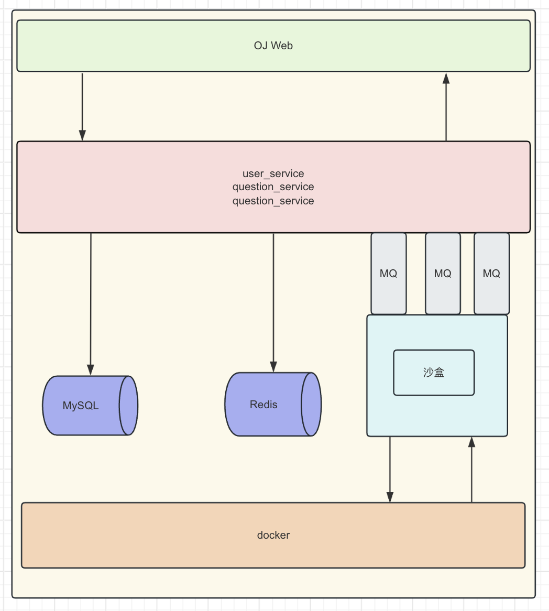

实现go语言完成OJ判题系统

OJ架构图：

目前完成进度：

- 用户登陆注册
- user_service 大致完成
- 库表设计完成
- 后端架构搭建完成

未完成：

- 沙盒架构设计 （已开始）
- 问题提交业务 （已开始）
- OJ平台前端 （已开始）
- 整体测试 (已开始)

未来规划
- 设计日志架构 (构建中)

## OJ 产品大致规划

### 登陆

- 邮箱登陆
- sms 登陆
- github登陆

### 注册

- 邮箱注册
- sms 注册

### 判题

- 支持 Java、Python、Go、C++

### 排行

- ac量最多排行

### 个人中心

- 用户名
- 用户头像（待定）
- 用户简介
- 性别
- 刷题总数
- 提交记录
- 积分制度

### 题解

- 各个题目不同语言、解法的题解。

### 竞赛

- 出题
- 排名

